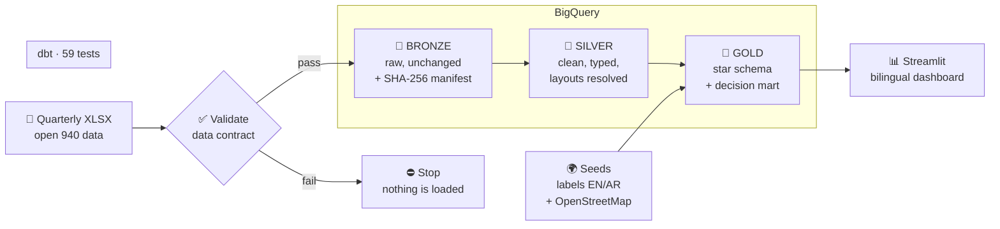
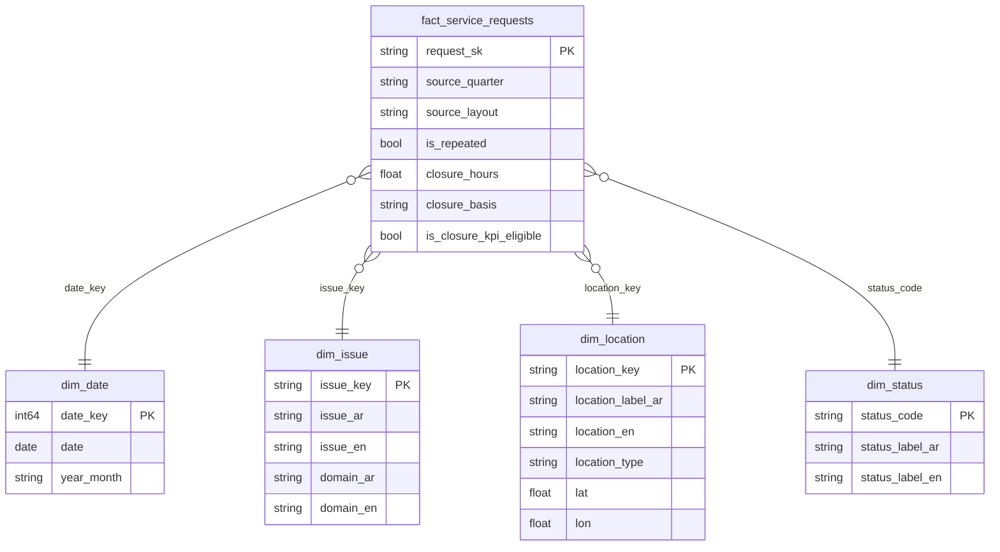

<div align="center">

# حيّ · HAYY

### Closed is not solved.

**An end-to-end data pipeline and bilingual dashboard that shows which municipal service requests are closed, but keep coming back.**

`Python` · `BigQuery` · `dbt` · `Airflow` · `Streamlit` · `OpenStreetMap`

**246,896 requests · 2 quarters · 59 data-quality checks · 7 real data-quality findings**

</div>

---

> **حيّ** means both *neighborhood* and *alive* in Arabic.
> A neighborhood is alive when its problems are fixed for good, not just closed on paper.

**بالعربي:** حيّ لوحة بيانات تفاعلية لبلاغات البلديات، هدفها مساعدة فرق تجربة العميل على اكتشاف البلاغات التي تُغلق ثم تعود، لمعالجة أسبابها الجذرية وتقليل تكرار الشكاوى.

---

## 📍 The question

Every municipal 940 request has a journey:

```
   ①  Received   ──►   ②  Processed   ──►   ③  Closed   ──►   ?  Repeated
```

Most reports stop at step ③: *how many requests were closed, and how fast?*
On paper, the picture looks excellent: **98.8% completion** and a **median closure time of 21 hours**.

**Hayy looks at the last step.** In the same data, **44.4% of requests are flagged as repeated.**

So the real question is not *"how fast do we close?"* but:

> **What happens after closure?**

---

## 🔎 What Hayy found

| Insight | Evidence from the pipeline |
|---|---|
| **Fast is not the same as fixed** | Street-vendor requests close in a median of **5 hours**, yet **80.4%** are flagged as repeated (Jan – Mar 2026). |
| **The pattern is persistent, not a one-off** | "Commercial facility observations" closed in a median of **11 hours in both quarters**, and about **two thirds** were repeated each time (2,263 requests in Q1, 12,364 in Q2). |
| **A small set of request types carries a large share** | In Jan – Jun 2026, **23 request types** close but come back, or close slowly and repeat. Together they are **41% of all requests**. |

Every request type is placed in one of four groups, compared with the median of its own quarter:

|  | **Rarely repeated** | **Often repeated** |
|---|---|---|
| **Fast** | 🟢 **Effective**: keep the current process | 🟡 **Root-cause attention**: find out why it returns |
| **Slow** | 🔵 **Operational delay**: shorten the response time | 🔴 **Priority**: handle first |

> **Descriptive, not causal.** Hayy shows *where* to look. It does not claim *why* it happens.
> "Repeated" is a flag published by the source. It does not prove that the same complaint returned.

---

## 🏗️ How it works



**Airflow** runs the whole chain with one trigger:

```
validate_2026Q1 ─► load_bronze_2026Q1 ─┐
                                       ├─► dbt_build  (Silver + Gold + 59 tests)
validate_2026Q2 ─► load_bronze_2026Q2 ─┘
```

A full run takes about **2 minutes**. If validation fails, nothing is loaded. If a Silver test fails, Gold is not built.

| Layer | What it holds | Rule |
|---|---|---|
| 🥉 **Bronze** | Every row and value exactly as published, all as text, plus lineage columns (source file, Excel row, file hash, batch, load time) | Never changed. Even the hidden header row is kept. |
| 🥈 **Silver** | One row per request, typed and cleaned, with quality flags | Nothing is deleted silently. Problems are flagged. |
| 🥇 **Gold** | A star schema and a decision mart | The dashboard reads from Gold only. |

---

## 🧩 When the data fought back

The most valuable part of this project was not the code. It was what the data revealed.
All findings are documented with evidence in [`docs/data_quality_findings.md`](docs/data_quality_findings.md).

### 1. Two layouts inside one file *(critical)*

The Q2 file kept the **same column names** as Q1, but changed what is inside them:

| Column header in the file | Layout A (Q1 + last 78 rows of Q2) | Layout B (212,718 rows of Q2) |
|---|---|---|
| حالة البلاغ *(status)* | request status | **closure time in hours** |
| زمن الإغلاق *(closure time)* | closure time | **a 6-hour time band** |

A naive pipeline would not crash. It would quietly report a **0% completion rate**.
Hayy detects the layout **per row, from the content**, and records it in a `source_layout` column.
The evidence: the median of the "status" column in Layout B is **21**, close to the Q1 median closure time of **20 hours**.

### 2. The documented schema does not match the files

The portal lists 7 columns, including a request number. Every file has 6. **There is no request ID**, so Hayy builds a surrogate key from the file hash and the Excel row.

### 3. Names change between releases

Sheet names (`Sheet1` → `2026`), a column name (`الموقع` → `اسم الموقع`) and the file name changed every quarter. The pipeline never depends on a name. Column aliases live in a [data contract](config/contract_940.yml).

### 4. A request with no location *(found by a test, not by profiling)*

Kept, flagged with `is_location_missing`, and tested with a tolerance: warn above 0, fail above 100.

### 5. A key collision *(found by counting tests)*

Missing locations were mapped to "غير محدد", a value that **also exists in the source**. The `unique` test caught it, but only after we noticed that **32 tests ran instead of 35**: dbt had silently disabled three tests. The fix uses a sentinel key in one shared macro.

### 6. The same request type, spelled two ways

Q2 dropped hyphens, slashes and some spaces. **272 raw names are really 245 request types.** Without a fix, the same issue looks "new" in Q2. A seed maps every variant to one canonical code.

### 7. Neighborhood names cut to one word

Q1 has no multi-word location; Q2 has 87. Q1 "الملك" could be King Fahd, King Faisal or King Salman. These values are typed `truncated_name` and excluded from neighborhood rankings.

---

## 🧱 Data model



Plus two Gold models built on top:

- **`gold_issue_performance`**: one row per (quarter, request type) with volume, repeat rate, exact median closure time and the decision group.
- **`rpt_service_requests`**: the fact joined to every dimension, with KPI rules already applied, so the dashboard only displays numbers and never redefines them.

### KPI definitions

| KPI | Definition |
|---|---|
| Repeat rate | Requests flagged as repeated by the source ÷ all requests |
| Completion rate | Completed ÷ (completed + in progress), **only where a status is published** |
| Median closure time | Exact median, only for completed requests with a valid closure time (and Q2 requests with a closure value but no published status, labelled `closure_value_only`) |
| Decision group | Compared with the median of all request types **in the same quarter**, for request types with at least 30 requests |

---

## ✅ Quality gates

| Where | What is checked | How many |
|---|---|---|
| **Before loading** | Required columns, column count, aliases, embedded headers, row layout, accepted values | Python validator |
| **Validator code** | Valid file, Layout B detection, renamed column, missing column, embedded header, unknown status | 6 `pytest` tests |
| **Bronze → Silver** | No row lost (reconciliation), dates inside their quarter, layout and time band agree, no negative closure time | dbt |
| **Silver** | Unique keys, accepted values, not-null with tolerance thresholds | dbt |
| **Gold** | Every fact row points to an existing dimension row (referential integrity), mart totals equal fact totals | dbt |
| **Seeds** | Every request type and neighborhood has a label in both languages, or a warning is raised | dbt |

**59 dbt checks** run on every pipeline run. One stays as a known, documented warning: the single request with no location.

The habit that caught two hidden bugs: **a green run is not enough. Always check that the expected number of tests actually ran.**

---

## 📊 The dashboard

A bilingual Streamlit app. **One language per page**, never mixed: Arabic is fully right-to-left, including the charts.

| Page | For | Answers |
|---|---|---|
| **Overview** | Decision-makers | How is the service doing, and is it improving? |
| **Where to act** | Customer-experience teams | Which request types close but come back, and what to review first |
| **Neighborhood map** | Operations | Where requests and repeats concentrate |
| **Data reliability** | Analysts | How far the numbers can be trusted, and why |

Design choices that matter:

- The hero follows the **request journey**: Received → Processed → Closed → **Repeated?**
- Periods are shown as months (**Jan – Mar 2026**), not codes like `2026Q1`.
- When a status is not published, the dashboard says **"Not published"** instead of showing a misleading percentage.
- Brand yellow is reserved for **root-cause attention**, the core idea of the project.

<!-- Screenshots: add these files to docs/images/ -->
<p align="center">
  
  
</p>
<p align="center">
  
  
</p>

---

## 🧠 Decisions worth explaining

Architecture decisions are recorded as ADRs in [`docs/decisions.md`](docs/decisions.md).

| Decision | Why |
|---|---|
| **BigQuery Sandbox, no Cloud Storage** (ADR-001) | Google Cloud billing in Saudi Arabia goes through a regional reseller. Bronze was redesigned: raw files keep a SHA-256 hash in a manifest, and are loaded as-is into a Bronze dataset. Tables expire after 60 days, so the pipeline rebuilds every layer from Bronze with one command. |
| **One Airflow task at a time** (ADR-002) | On a laptop with 3.7 GB for Linux, parallel tasks stopped the scheduler. Diagnosed from the process list, fixed with one setting. |
| **Idempotent loads** | Each quarter replaces its own Bronze table. Running the pipeline twice gives the same result. |
| **Airflow in its own environment** | Airflow only orchestrates. The work runs in the project environment, so their dependencies never conflict. |
| **Rules in dbt, display in the dashboard** | Every KPI is defined once in SQL and tested. The dashboard cannot drift from the definitions. |
| **Translate unique values once** | 245 request types and 257 locations are translated in seeds, not row by row. 149 English labels follow the official wording published by the source. |
| **Arabic is the source of truth** | English is always an added column, never a replacement. |

---

## 🚀 Run it yourself

<details>
<summary><b>Prerequisites</b></summary>

- Linux, macOS or Windows with WSL
- Python 3.12 and [`uv`](https://github.com/astral-sh/uv)
- A Google account with a BigQuery project (the free Sandbox is enough)
- The `gcloud` CLI

</details>

**1. Set up**

```bash
git clone https://github.com/samaalharbi2/BALAGH.git && cd BALAGH
uv venv --python 3.12 .venv && source .venv/bin/activate
uv pip install -r requirements.txt

gcloud auth application-default login
export GCP_PROJECT_ID="your-project-id"
for ds in balagh_bronze balagh_silver balagh_gold; do bq --location=US mk --dataset ${GCP_PROJECT_ID}:${ds}; done
```

Create `~/.dbt/profiles.yml` (kept outside the repo, no secrets inside):

```yaml
balagh:
  target: dev
  outputs:
    dev:
      type: bigquery
      method: oauth
      project: your-project-id
      dataset: balagh_silver
      location: US
      threads: 4
```

**2. Add the data**

Download the quarterly XLSX files from the municipality open-data portal and save them as `data/raw/940_2026Q1.xlsx` and `data/raw/940_2026Q2.xlsx`. Raw data is never committed.

**3. Run the pipeline**

With Airflow:

```bash
./airflow/start_airflow.sh        # then trigger "balagh_pipeline" at http://localhost:8080
```

Or step by step:

```bash
python -m src.ingestion.validate_schema data/raw/940_2026Q1.xlsx data/raw/940_2026Q2.xlsx
python -m src.ingestion.load_bronze data/raw/940_2026Q1.xlsx 2026Q1
python -m src.ingestion.load_bronze data/raw/940_2026Q2.xlsx 2026Q2
cd dbt/balagh && dbt build && cd ../..
```

**4. Open the dashboard**

```bash
streamlit run dashboard/app.py    # http://localhost:8501
```

**Run the tests**

```bash
python -m pytest -v               # validator unit tests
cd dbt/balagh && dbt test         # data-quality tests
```

---

## 🗂️ Project structure

```
BALAGH/
├── airflow/
│   ├── dags/balagh_pipeline_dag.py     # validate → Bronze → dbt build
│   └── start_airflow.sh                # isolated local Airflow
├── config/contract_940.yml             # data contract: columns, aliases, layouts, rules
├── src/
│   ├── ingestion/
│   │   ├── validate_schema.py          # structure checks, layout detection
│   │   └── load_bronze.py              # unchanged load + SHA-256 manifest
│   └── enrichment/geocode_locations.py # one-time OpenStreetMap enrichment
├── dbt/balagh/
│   ├── models/silver/                  # cleaning, layout resolution, flags
│   ├── models/gold/                    # star schema, decision mart, report table
│   ├── seeds/                          # EN/AR labels, canonical codes, coordinates
│   ├── macros/                         # shared key logic, schema naming
│   └── tests/                          # reconciliation and business-rule tests
├── dashboard/app.py                    # bilingual Streamlit dashboard
├── tests/                              # pytest for the validator
├── data/manifests/                     # one manifest per loaded file (lineage)
└── docs/
    ├── data_quality_findings.md        # 7 findings with evidence
    ├── decisions.md                    # architecture decision records
    └── data_sources.md                 # sources, file names, languages
```

---

## ⚠️ Limitations

Being honest about limits is part of data quality.

- **"Repeated" is a source flag.** It does not prove that the same complaint returned.
- **From April 2026, most requests have no published status.** Completion rate is shown only where a status exists.
- **The meaning of the Q2 time band is inferred** (most likely the received time). The publisher does not document it.
- **Q1 neighborhood names are cut to one word.** Compare neighborhoods within one period only.
- **Map positions are approximate** neighborhood centers from OpenStreetMap. 188 of 197 neighborhoods were placed. The other 9 stay in every count and table.
- **Q2 is about six times larger than Q1.** It may cover a wider area. This is an open question, so the dashboard compares rates, not raw volumes.
- **The analysis is descriptive.** It shows where to look, not why something happens.

---

## 🛣️ Roadmap

- [ ] **More cities**: the pipeline is not tied to one city. A new city needs a data contract and its seeds.
- [ ] **New quarters automatically**: add the quarter to one list in the DAG and in dbt.
- [ ] **Voice of the Customer**: add public app reviews as a separate fact, compared only at an aggregate level.
- [ ] **CI**: run `pytest` and `dbt parse` on every push with GitHub Actions.
- [ ] **Public demo**: a recorded walkthrough of the pipeline and the dashboard.

---

## 💡 What I learned

- **Read the data before you trust the column names.** The biggest problem in this project had the right header and the wrong content.
- **Tests are only useful if they run.** Counting them caught bugs that a green run hid.
- **Never delete quietly.** Flag, document, and keep every row accountable.
- **Constraints shape good architecture.** No billing account led to a cleaner, rebuildable Bronze layer.
- **A dashboard is only as honest as its definitions.** Keep the rules in one tested place.

---

<div align="center">

**Built by [Sama Alharbi](https://github.com/samaalharbi2)** · Data Engineering

*Data: open 940 service-request data published by the municipality. Map data © OpenStreetMap contributors.*

**حيّ: لأن الحي الحيّ مشاكله تنحل، مو بس تنقفل.**

</div>
