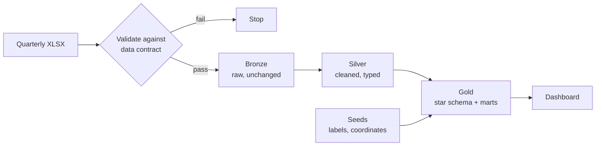
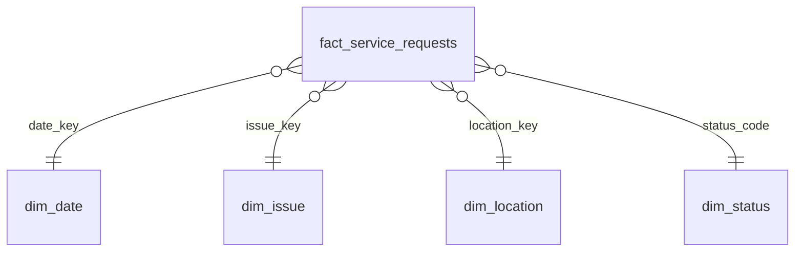

# حيّ · HAYY

A data pipeline and bilingual (Arabic / English) dashboard for municipal 940 service requests. It measures closure speed **and** recurrence, to identify request types that are closed but keep being reported again.

**Scope:** 246,896 requests · Jan – Jun 2026 · Riyadh open data (the pipeline is not tied to one city)

---

## Tech stack

| Tool | Role |
|---|---|
| Python, pandas | Schema validation and raw-file ingestion |
| BigQuery (Sandbox) | Warehouse: Bronze, Silver and Gold datasets |
| dbt | Transformations, data-quality tests, lineage |
| Apache Airflow | Orchestration |
| Streamlit, Plotly | Dashboard |
| OpenStreetMap Nominatim | Neighborhood coordinates (one-time enrichment) |
| pytest, uv, Git | Unit tests, environments, version control |

---

## Architecture



| Layer | Content |
|---|---|
| Bronze | Every row as published, all text, plus lineage: source file, Excel row, SHA-256, batch ID, load time |
| Silver | One row per request, typed, with quality flags. Nothing is deleted silently |
| Gold | Fact and dimension tables, a per-issue performance mart, and a reporting table for the dashboard |

Pipeline DAG (runtime ≈ 2 min):

```
validate_2026Q1 → load_bronze_2026Q1 ─┐
                                      ├→ dbt_build (Silver + Gold + tests)
validate_2026Q2 → load_bronze_2026Q2 ─┘
```

---

## Data-quality findings

Full evidence in [`docs/data_quality_findings.md`](docs/data_quality_findings.md).

| # | Finding | Handling |
|---|---|---|
| 1 | Q2 keeps the Q1 column names, but in 212,718 rows "status" holds closure hours and "closure time" holds a 6-hour time band | Layout detected per row from content; stored as `source_layout` (A / B) |
| 2 | Portal lists 7 columns including a request number; files have 6 and no ID | Surrogate key: `md5(file_sha256 + source_row_number)` |
| 3 | Sheet name, location column name and file name change every release | Column aliases in [`config/contract_940.yml`](config/contract_940.yml) |
| 4 | One request with no location | Kept and flagged; not-null test with warn > 0, error > 100 |
| 5 | Key collision between a missing location and the literal value "غير محدد" | Sentinel key in a shared macro |
| 6 | 272 issue-type spellings are 245 real types (Q2 dropped hyphens and slashes) | Seed maps every variant to one canonical code |
| 7 | Q1 locations cut to the first word (no multi-word names in Q1, 87 in Q2) | Typed `truncated_name`, excluded from neighborhood rankings |

---

## Data model



| Model | Grain |
|---|---|
| `fact_service_requests` | One row per request |
| `dim_issue` | 245 canonical request types, Arabic and English labels, 12 service domains |
| `dim_location` | 257 locations with type and coordinates (188 of 197 neighborhoods placed) |
| `gold_issue_performance` | One row per (quarter, request type) with the decision group |
| `rpt_service_requests` | Fact joined to all dimensions, KPI columns pre-computed |

---

## Tests

| Layer | Checks | Count |
|---|---|---|
| Validator | Valid file, layout B detection, renamed column, missing column, embedded header, unknown status | 6 (pytest) |
| Silver | Bronze → Silver reconciliation, dates within quarter, layout consistency, accepted values, unique keys | dbt |
| Gold | Referential integrity, mart totals = fact totals | dbt |
| Seeds | Every issue type and location has a label | dbt |

Total: 59 dbt tests (58 pass, 1 documented warning for the missing location).


---

## Dashboard


<!-- Add screenshots to docs/images/ -->
<p>
  
  
</p>

---

## Run locally

```bash
# 1. Environment
uv venv --python 3.12 .venv && source .venv/bin/activate
uv pip install -r requirements.txt
gcloud auth application-default login
export GCP_PROJECT_ID="your-project-id"
for ds in balagh_bronze balagh_silver balagh_gold; do bq --location=US mk --dataset ${GCP_PROJECT_ID}:${ds}; done

# 2. Data: save the quarterly files as data/raw/940_2026Q1.xlsx and data/raw/940_2026Q2.xlsx

# 3. Pipeline (Airflow UI on :8080, DAG "balagh_pipeline")
./airflow/start_airflow.sh

#    or manually
python -m src.ingestion.validate_schema data/raw/940_2026Q1.xlsx data/raw/940_2026Q2.xlsx
python -m src.ingestion.load_bronze data/raw/940_2026Q1.xlsx 2026Q1
python -m src.ingestion.load_bronze data/raw/940_2026Q2.xlsx 2026Q2
cd dbt/balagh && dbt build && cd ../..

# 4. Dashboard (:8501)
streamlit run dashboard/app.py

# Tests
python -m pytest -v
```

dbt reads `~/.dbt/profiles.yml` (outside the repo, `method: oauth`, dataset `balagh_silver`, location `US`).

---

## Project structure

```
airflow/          DAG and local start script
config/           data contract
src/ingestion/    validate_schema.py, load_bronze.py
src/enrichment/   geocode_locations.py
dbt/balagh/       models (silver, gold), seeds, macros, tests
dashboard/        app.py
tests/            pytest
data/manifests/   one manifest per loaded file
docs/             findings, decisions (ADRs), data sources
```


---

**Author:** [Sama Alharbi](https://github.com/samaalharbi2) · Data source: open 940 service-request data · Map data © OpenStreetMap contributors
